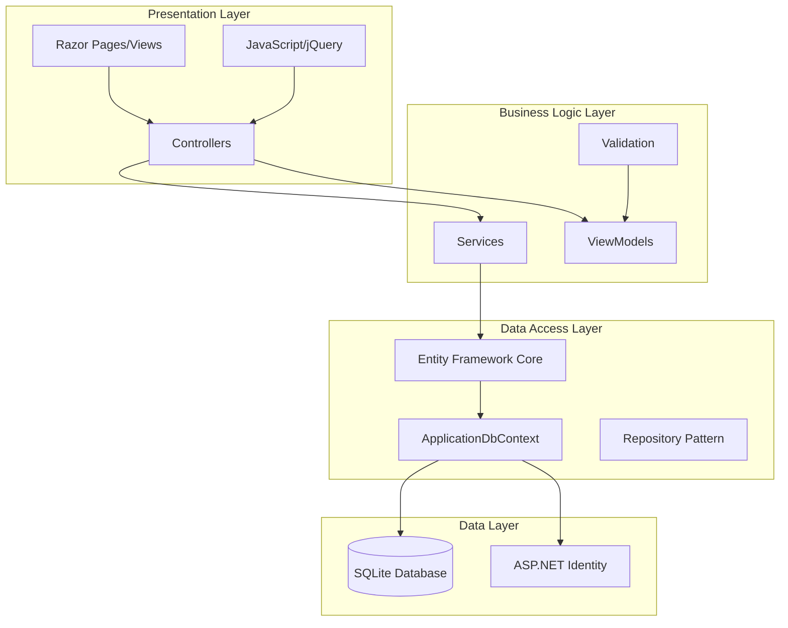
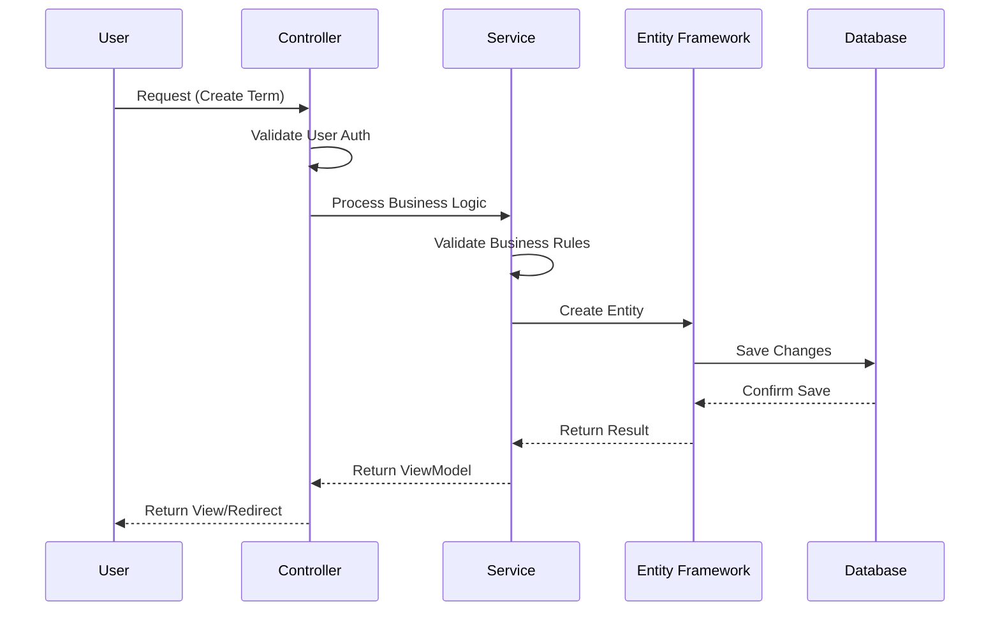

# Academic Management System V4

[](https://dotnet.microsoft.com/download/dotnet/9.0)
[](LICENSE)
[](https://github.com/awray13/AcademicManagementSystemV4)

A comprehensive ASP.NET Core Razor Pages application designed for managing academic terms, courses, assessments, and user authentication. Built with modern web technologies and following best practices for educational institutions.

## 🎯 Overview

The Academic Management System provides a streamlined platform for students and educational staff to manage academic activities, track progress, and organize coursework efficiently. The system emphasizes user security, data integrity, and intuitive user experience.

## ✨ Features

### 📚 Core Academic Management
- **Term Management**: Create, edit, and manage academic terms with date validation and overlap detection
- **Course Management**: Handle course creation, enrollment, and progress tracking
- **Assessment Templates**: Standardized assessment creation with predefined templates
- **Progress Tracking**: Real-time progress monitoring and completion percentages

### 🔐 Authentication & Security
- **ASP.NET Core Identity**: Secure user authentication and authorization
- **Role-Based Access**: Student, Staff, and Administrator roles
- **Profile Management**: Complete user profile system with timezone support
- **Security Validation**: Anti-forgery tokens and secure data access

### 🎨 User Experience
- **Responsive Design**: Bootstrap 5 with mobile-first approach
- **Accessibility**: WCAG-compliant with screen reader support
- **Real-time Feedback**: Toast notifications and validation messages
- **Intuitive Navigation**: Clean, modern interface with Font Awesome icons

## 🏗️ Architecture & Design

### System Architecture



### Data Flow Architecture



### Domain Model

classDiagram
    class ApplicationUser { 
        +string FirstName 
        +string LastName
        +string TimeZone 
        +DateTime CreatedAt 
        +DateTime? LastLoginAt 
        +bool IsProfileComplete 
        +string FullName 
        +string Initials 
        +ICollection~Term~ Terms 
        +UpdateLastLogin() 
        +CompleteProfile() 
        +HasCompleteProfile() bool 
    }

    class BaseEntity {
        <<abstract>>
        +int Id
        +DateTime CreatedAt
        +DateTime UpdatedAt
    }

    class Term {
        +string Name
        +DateTime StartDate
        +DateTime EndDate
        +string Description
        +string UserId
        +ApplicationUser User
        +ICollection~Course~ Courses
        +bool IsValidDateRange
    }

    class Course {
        +string CourseNumber
        +string Title
        +string Description
        +int CreditHours
        +DateTime StartDate
        +DateTime EndDate
        +CourseStatus Status
        +int TermId
        +Term Term
        +ICollection~Assessment~ Assessments
        +double CompletionPercentage
    }

    class Assessment {
        +string Name
        +string Description
        +AssessmentType Type
        +DateTime DueDate
        +AssessmentStatus Status
        +double? Score
        +double MaxPoints
        +int CourseId
        +Course Course
        +bool IsOverdue
        +int DaysUntilDue
    }

    class CourseTemplate {
        +string CourseNumber
        +string Title
        +string Description
        +int CreditHours
        +ICollection~AssessmentTemplate~ AssessmentTemplates
        +string DisplayName
    }

    class AssessmentTemplate {
        +string Name
        +string Description
        +AssessmentType Type
        +double MaxPoints
        +int DaysFromCourseStart
        +int CourseTemplateId
        +CourseTemplate CourseTemplate
    }

    class CourseStatus {
        <<enumeration>>
        NotStarted
        InProgress
        Completed
        Dropped
    }

    class AssessmentType {
        <<enumeration>>
        Objective
        Performance
        Project
        Exam
        Quiz
        Assignment
    }

    class AssessmentStatus {
        <<enumeration>>
        NotStarted
        InProgress
        Completed
        Submitted
        Graded
    }

    ApplicationUser "1" --> "*" Term : owns
    Term "1" --> "*" Course : contains
    Course "1" --> "*" Assessment : has
    CourseTemplate "1" --> "*" AssessmentTemplate : defines
    BaseEntity <|-- Term
    BaseEntity <|-- Course
    BaseEntity <|-- Assessment
    BaseEntity <|-- CourseTemplate
    BaseEntity <|-- AssessmentTemplate
    Course --> CourseStatus : uses
    Assessment --> AssessmentType : uses
    Assessment --> AssessmentStatus : uses

## 🛠️ Technology Stack

| Layer | Technology | Purpose |
|-------|------------|---------|
| **Framework** | ASP.NET Core 9.0 | Web application framework |
| **Language** | C# 13.0 | Primary programming language |
| **Database** | SQLite | Local development database |
| **ORM** | Entity Framework Core | Data access and migrations |
| **Authentication** | ASP.NET Core Identity | User management and security |
| **Frontend** | Razor Pages | Server-side rendered views |
| **CSS Framework** | Bootstrap 5 | Responsive design |
| **Icons** | Font Awesome | UI iconography |
| **JavaScript** | jQuery | Client-side interactivity |
| **Build Tool** | MSBuild | Compilation and packaging |

## 🚀 Getting Started

### Prerequisites

- [.NET 9 SDK](https://dotnet.microsoft.com/download/dotnet/9.0)
- [Visual Studio 2022](https://visualstudio.microsoft.com/) or [VS Code](https://code.visualstudio.com/)
- [Git](https://git-scm.com/)

### Installation & Setup

1. **Clone the repository**
   ```bash
   git clone https://github.com/awray13/AcademicManagementSystemV4.git
   cd AcademicManagementSystemV4
   ```

2. **Restore NuGet packages**
   ```bash
   dotnet restore
   ```

3. **Update database connection** (Optional)
   - Edit `appsettings.json` to modify the connection string if needed
   - Default uses SQLite with local file storage

4. **Apply database migrations**
   ```bash
   dotnet ef database update
   ```

5. **Run the application**
   ```bash
   dotnet run
   ```

6. **Access the application**
   - Navigate to `https://localhost:7243` (or the port shown in terminal)
   - Use demo credentials:
     - **Student**: `student@wgu.edu` / `Password123!`
     - **Staff**: `advisor@wgu.edu` / `Password123!`

## 📁 Project Structure

```
AcademicManagementSystemV4/
├── Controllers/           # MVC controllers for handling requests
│   ├── AccountController.cs
│   ├── CoursesController.cs
│   └── TermsController.cs
├── Data/                 # Database context and configurations
│   ├── ApplicationDbContext.cs
│   ├── Migrations/
│   └── SeedData.cs
├── Models/               # Data models and view models
│   ├── ApplicationUser.cs
│   ├── Assessment.cs
│   ├── Course.cs
│   ├── Term.cs
│   └── ViewModels/
├── Services/             # Business logic services
│   └── CourseTemplateService.cs
├── Views/               # Razor pages and layouts
│   ├── Account/
│   ├── Courses/
│   ├── Terms/
│   └── Shared/
├── wwwroot/             # Static files
│   ├── css/
│   ├── js/
│   └── lib/
├── Program.cs           # Application entry point
└── appsettings.json     # Configuration settings
```

## 🔧 Configuration

### Database Configuration

The application uses SQLite by default with the following connection string:

```json
{
  "ConnectionStrings": {
    "DefaultConnection": "Data Source=academic_management.db"
  }
}
```

### Identity Configuration

- **Password Requirements**: Minimum 6 characters, requires digit and uppercase letter
- **Account Lockout**: 5 failed attempts, 5-minute lockout period
- **Email Confirmation**: Optional (disabled in development)

### Logging Configuration

Structured logging with different levels:
- **Development**: Information and above
- **Production**: Warning and above

## 🧪 Sample Data

The application includes comprehensive seed data:

- **3 Academic Terms**: Fall 2024, Spring 2025, Summer 2025
- **5 Courses**: CS101, CS201, MATH201, ENG102, CS301
- **15+ Assessments**: Various types including projects, exams, and quizzes
- **Course Templates**: Predefined course structures with assessment templates
- **Demo Users**: Student and staff accounts with different permission levels

## 🔒 Security Features

- **Authentication**: ASP.NET Core Identity with secure password hashing
- **Authorization**: Role-based access control (Student, Staff, Administrator)
- **Data Protection**: Anti-forgery tokens and SQL injection prevention
- **User Isolation**: Users can only access their own data
- **Input Validation**: Server-side and client-side validation
- **Secure Cookies**: HTTPOnly and Secure flags enabled

## 🎨 UI/UX Features

- **Responsive Design**: Mobile-first approach with Bootstrap 5
- **Accessibility**: Screen reader support and keyboard navigation
- **Visual Feedback**: Toast notifications and form validation
- **Progressive Enhancement**: Works without JavaScript
- **Loading States**: Smooth transitions and loading indicators
- **Error Handling**: User-friendly error messages and recovery options

## 📊 Performance Considerations

- **Entity Framework**: Optimized queries with proper includes
- **Async/Await**: Non-blocking database operations
- **Caching**: Browser caching for static assets
- **Minification**: CSS and JavaScript optimization
- **Lazy Loading**: Efficient data loading strategies

## 🧪 Testing

### Running Tests
```bash
dotnet test
```

### Test Coverage
- Unit tests for business logic
- Integration tests for controllers
- Database tests with in-memory provider

## 🚀 Deployment

### Development
```bash
dotnet run --environment Development
```

### Production
```bash
dotnet publish -c Release -o ./publish
```

### Docker Support
```dockerfile
FROM mcr.microsoft.com/dotnet/aspnet:9.0
COPY bin/Release/net9.0/publish/ App/
WORKDIR /App
ENTRYPOINT ["dotnet", "AcademicManagementSystemV4.dll"]
```

## 🤝 Contributing

1. **Fork the repository**
2. **Create a feature branch** (`git checkout -b feature/AmazingFeature`)
3. **Commit your changes** (`git commit -m 'Add some AmazingFeature'`)
4. **Push to the branch** (`git push origin feature/AmazingFeature`)
5. **Open a Pull Request**

### Coding Standards
- Follow C# coding conventions
- Use meaningful variable and method names
- Include XML documentation for public methods
- Write unit tests for new features
- Follow SOLID principles

## 📝 License

This project is licensed under the MIT License - see the [LICENSE](LICENSE) file for details.

## 🙏 Acknowledgments

- **ASP.NET Core Team** for the excellent framework
- **Bootstrap Team** for the responsive CSS framework
- **Entity Framework Team** for the powerful ORM
- **Font Awesome** for the beautiful icons
- **Western Governors University** for the educational context

## 📞 Support

For support and questions:
- **GitHub Issues**: [Report bugs or request features](https://github.com/awray13/AcademicManagementSystemV4/issues)
- **Discussions**: [Community discussions and Q&A](https://github.com/awray13/AcademicManagementSystemV4/discussions)

---

**Built with ❤️ for educational excellence**